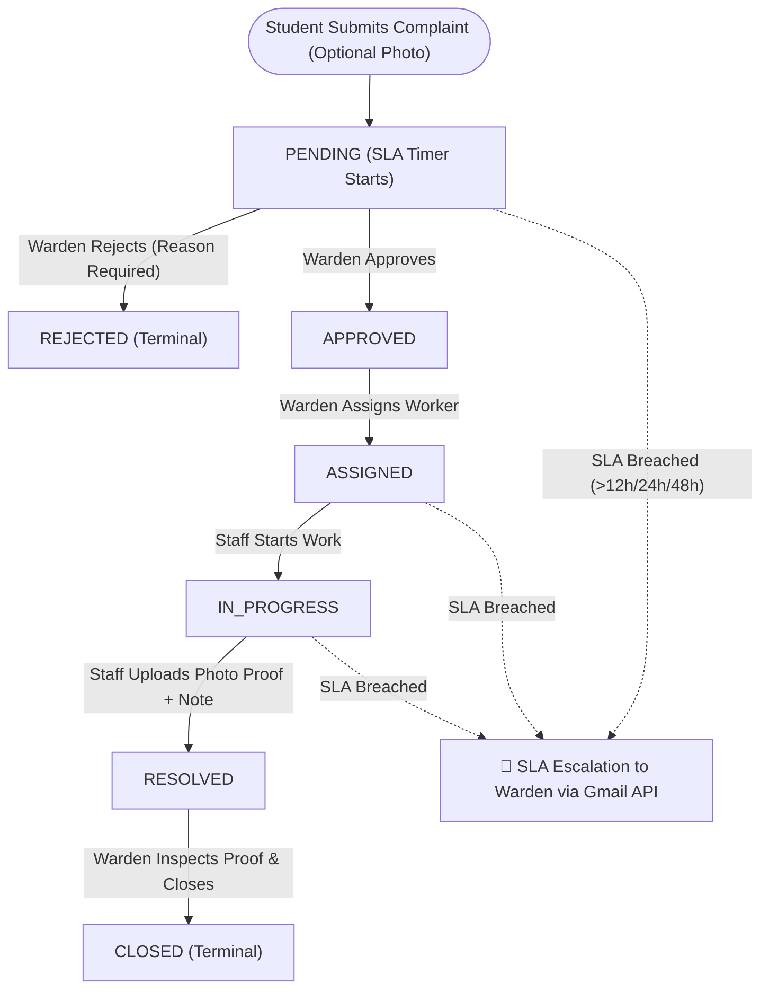
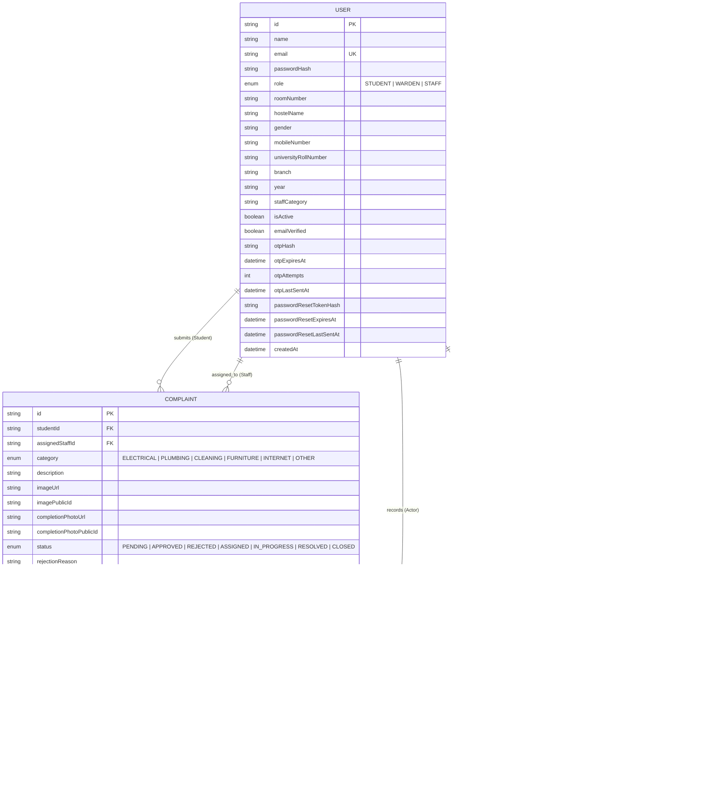

<div align="center">

# 🏠 HostelFix

### Enterprise-Grade Hostel Complaint Lifecycle, SLA Escalation, AI Photo OCR & Mess Management Platform

[](https://react.dev/)
[](https://nodejs.org/)
[](https://www.prisma.io/)
[](https://cloudinary.com/)
[](https://github.com/naptha/tesseract.js)
[](https://developers.google.com/gmail/api)
[](https://www.npmjs.com/package/node-cron)
[](./server)
[](LICENSE)

A high-accountability digital operations platform replacing outdated, informal communication channels (paper registers, WhatsApp chats, verbal notices) with a role-enforced complaint lifecycle, category-based SLA deadlines with automated email escalation, technician photo verification, weekly mess management with Tesseract.js OCR photo extraction, and comprehensive resident & staff directory for university residence halls.

[Key Features](#-key-features) • [User Roles & RBAC](#-user-roles--access-matrix) • [Hostel Scoping](#-campus-hostels--gender-scoping) • [Complaint Workflow](#-complaint-lifecycle-workflow) • [SLA Escalation](#-sla-deadlines--automated-escalation) • [Photo Proof](#-photo-upload--work-completion-proof) • [Menu Photo OCR](#-warden-menu-photo-ocr-extraction) • [Quick Start](#-quick-start-guide) • [Test Suite](#-automated-test-verification-430-tests) • [Evaluation Accounts](#-evaluation-demo-accounts)

---

</div>

## 📌 Problem & Solution

| Traditional Campus Hostels (The Problem) | HostelFix Platform (The Solution) |
|---|---|
| **Fragmented Reporting:** Maintenance requests scattered across WhatsApp groups and paper logbooks. | **Centralized Hub:** Strict digital ticketing with role-based routing and automated tracking. |
| **Zero Status Visibility:** Students have no way to know if their issue is reviewed, assigned, or ignored. | **Live 6-Stage Timeline:** Real-time visibility into every stage from submission to closure. |
| **Lack of Worker Accountability:** Jobs marked done verbally without inspection or tangible evidence. | **Mandatory Completion Proof:** Technicians cannot resolve tickets without resolution notes and photo proof. |
| **Ignored Breaches & Delays:** Critical electrical and plumbing failures languish unattended for days. | **SLA Engine & Auto-Escalation:** Background cron automatically escalates overdue tickets to wardens via Gmail API. |
| **Manual Dining Schedule Updates:** Wardens manually type 28 meal slots every week. | **AI/OCR Menu Extraction:** Wardens upload a photo of the mess timetable; Tesseract.js parses all 28 slots for review. |
| **Broken Link Resets & Unsecured Accounts:** Password links fail on redirect; student registrations are unverified. | **Cryptographic 6-Digit Email-OTP:** Instant, timing-safe OTP verification powered by Google Gmail API OAuth 2.0. |

---

## ✨ Key Features

### 📋 1. Immutable 6-Stage Complaint Lifecycle
- State progression: `PENDING` → `APPROVED` → `ASSIGNED` → `IN_PROGRESS` → `RESOLVED` → `CLOSED` (or `REJECTED` with mandatory rejection justification).
- Every state change logs an append-only audit record in `StatusLog` with actor ID, timestamps, old status, new status, and action notes.

### ⏱️ 2. Automated SLA Monitoring & Escalation Daemon
- Every complaint is automatically stamped with an `slaDeadline` based on its category:
  - **Electrical, Plumbing, Internet:** 12 Hours
  - **Cleaning:** 24 Hours
  - **Furniture, Other:** 48 Hours
- A standalone background daemon (`node-cron`) executes every 5 minutes, scanning for non-terminal overdue tickets and dispatching urgent escalation emails to hostel-scoped wardens via the Gmail API.

### 📸 3. Cloudinary Photo Upload & Work Completion Proof
- **Student Issue Photo (Optional):** Attach JPEG, PNG, or WebP photos ($\le$ 5MB) during complaint creation.
- **Mandatory Technician Proof (Strictly Enforced):** Technicians **cannot** mark a ticket as `RESOLVED` without providing both resolution notes and an uploaded photo demonstrating the completed repair.
- **High-Resolution Lightbox:** Click any photo across student, warden, or staff portals to inspect full-size images in an interactive lightbox modal.
- **Offline / CI Resilient:** Automatically falls back to local Data-URI encoding if Cloudinary credentials are omitted.

### 🍽️ 4. Weekly Mess Management & AI Photo OCR Extraction
- **Warden "Update Menu from Photo":** Wardens upload a picture or phone capture of the official mess timetable.
- **Tesseract.js OCR Pipeline:** Multi-pass image processing, contrast stretching, column slicing, and fuzzy header matching (`TURSDAY`, `JATURDAY`, etc.) extracts all 28 meal slots (Monday–Sunday $\times$ Breakfast, Lunch, Snacks, Dinner).
- **Interactive Review Table:** Wardens review and edit extracted text in an editable modal before publishing.
- **Feedback Preservation:** Updating the weekly menu preserves all historical student star ratings (1–5) and comments.

### 🔐 5. Institutional Email Verification & 3-Step Email-OTP Password Reset
- **Chitkara University Domain Gating:** Student registration is restricted to `@chitkarauniversity.edu.in`.
- **6-Digit Cryptographic OTPs:** Generated via `crypto.randomInt()`, hashed with SHA-256 (`never` stored in plaintext).
- **Google Gmail API Integration:** Sends transactional verification and password reset emails via Gmail OAuth 2.0 (eliminates blocked outbound SMTP ports 25/465/587 on cloud hosting).
- **Anti-Abuse Protections:** 10-minute expiry, 60-second resend rate-limit cooldown, and 5-attempt brute-force lockout.
- **Robust 3-Step Wizard:** Step 1 (Email) $\rightarrow$ Step 2 (OTP Verification) $\rightarrow$ Step 3 (New Password), eliminating fragile query parameter redirects.

### 👥 6. Warden User Management Suite (`/warden/users`)
- **Resident Directory:** Wardens inspect resident students scoped to their assigned hostel, searchable by student name, roll number, academic branch, or room number.
- **Academic Profile Inspector:** Modal view showing student roll number, mobile, academic year, and room allocation.
- **Maintenance Worker Directory:** View assigned technician workloads, toggle duty status (`Active` / `Inactive` on leave), and provision new technician accounts.

### 🏢 7. Multi-Hostel & Gender Residential Scoping
- Complete physical hall separation between Boys and Girls residential complexes.
- Wardens are strictly scoped: a warden assigned to *Sarabhai Hostel* can only view and manage complaints, students, and alerts originating from *Sarabhai Hostel*.

### 🛡️ 8. Secure Administrative Onboarding (`/admin/staff-register`)
- Private gateway for provisioning new Wardens and Maintenance Technicians.
- Protected by `ADMIN_REGISTRATION_KEY` with hard 403 Forbidden barriers against unauthorized students.

---

## 👥 User Roles & Access Matrix

| Feature / Capability | 🎓 Student | 🏛️ Hostel Warden | 🔧 Maintenance Staff | 🛡️ Administrator |
|---|:---:|:---:|:---:|:---:|
| Public Self-Registration | ✅ (`@chitkarauniversity.edu.in`) | ❌ | ❌ | ❌ |
| Submit Maintenance Complaint | ✅ | ❌ | ❌ | ❌ |
| View Complaints | Own Only | Hostel-Scoped Only | Assigned Trade Only | All |
| Approve / Reject Complaints | ❌ | ✅ | ❌ | ✅ |
| Assign Work Orders to Workers | ❌ | ✅ | ❌ | ✅ |
| Mark In Progress / Resolved | ❌ | ❌ | ✅ | ✅ |
| Upload Work Completion Photo | ❌ | ❌ | ✅ (Mandatory) | ✅ |
| Verify & Close Complaints | ❌ | ✅ | ❌ | ✅ |
| Receive Overdue SLA Alerts | ❌ | ✅ (Email) | ❌ | ✅ |
| View Weekly Mess Menu | ✅ | ✅ | ✅ | ✅ |
| Submit Mess Review & Rating | ✅ | ❌ | ❌ | ❌ |
| Publish Mess Menu (Manual or OCR) | ❌ | ✅ | ❌ | ✅ |
| Access User Management Hub | ❌ | ✅ (Scoped) | ❌ | ✅ |
| Onboard New Staff & Wardens | ❌ | ✅ | ❌ | ✅ |

---

## 🏫 Campus Hostels & Gender Scoping

HostelFix enforces university housing policies by segregating residential wings and dynamically tailoring options:

```text
┌────────────────────────────────────────────────────────────────────────┐
│                        CHITKARA CAMPUS HOSTELS                         │
├───────────────────────────────────┬────────────────────────────────────┤
│           BOYS HOSTELS            │           GIRLS HOSTELS            │
│  • Sarabhai Hostel                │  • Bose Hostel                     │
│  • Bose Hostel                    │  • Gargi Hostel                    │
│  • Aryabhata Hostel               │  • Kalpana Hostel                  │
│                                   │  • Teresa Hostel                   │
└───────────────────────────────────┴────────────────────────────────────┘
```

> **Warden Isolation Rule:** A warden assigned to *Sarabhai Hostel* strictly views, approves, and manages complaints submitted by students in *Sarabhai Hostel*. Complaints from other residential buildings remain strictly isolated.

---

## 🔄 Complaint Lifecycle Workflow


```mermaid
flowchart TD
    SUBMIT(["Student Submits Complaint (Optional Photo)"]) --> PENDING["PENDING (SLA Timer Starts)"]
    
    PENDING -->|"Warden Rejects (Reason Required)"| REJECTED["REJECTED (Terminal)"]
    PENDING -->|"Warden Approves"| APPROVED["APPROVED"]
    APPROVED -->|"Warden Assigns Worker"| ASSIGNED["ASSIGNED"]
    ASSIGNED -->|"Staff Starts Work"| IN_PROGRESS["IN_PROGRESS"]
    IN_PROGRESS -->|"Staff Uploads Photo Proof + Note"| RESOLVED["RESOLVED"]
    RESOLVED -->|"Warden Inspects Proof & Closes"| CLOSED["CLOSED (Terminal)"]

    PENDING -.->|"SLA Breached (>12h/24h/48h)"| SLA["🚨 SLA Escalation to Warden via Gmail API"]
    ASSIGNED -.->|"SLA Breached"| SLA
    IN_PROGRESS -.->|"SLA Breached"| SLA
```

```text
Student Submits ──> [ PENDING ] ──(Warden Approves)──> [ APPROVED ] ──(Warden Assigns)──> [ ASSIGNED ]
                         │                                                                     │
                (Warden Rejects)                                                               │
                         │                                                                     ▼
                         ▼                                                             [ IN_PROGRESS ]
                  [ REJECTED ]                                                                 │
                                                                                         (Staff Works)
                                                                                               │
                                                                                   (Requires Photo Proof)
                                                                                               │
                                                                                               ▼
                  [ CLOSED ] <──(Warden Verifies)── [ RESOLVED ] <─────────────────────────────┘
```

---

## ⏱️ SLA Deadlines & Automated Escalation

Every complaint category is bound by a strict Service Level Agreement (SLA):

| Category | SLA Duration | Description |
|---|:---:|---|
| ⚡ **ELECTRICAL** | **12 Hours** | Tube lights, fans, switchboards, short circuits |
| 🚰 **PLUMBING** | **12 Hours** | Leaking taps, blocked drains, water supply issues |
| 🌐 **INTERNET** | **12 Hours** | Wi-Fi access point down, ethernet port faults |
| 🧹 **CLEANING** | **24 Hours** | Room cleaning, washroom hygiene, corridor upkeep |
| 🪑 **FURNITURE** | **48 Hours** | Broken study tables, bed frames, chair repair |
| 📦 **OTHER** | **48 Hours** | Miscellaneous maintenance requests |

### Automated SLA Cron Service
- **Execution Interval:** Every 5 minutes (`node-cron`).
- **Target:** Complaints where `slaDeadline < NOW()`, status is not `RESOLVED` or `CLOSED`, and `slaAlertSentAt` is `null`.
- **Deduplication:** Only sends one email per warden even if multiple complaints breach simultaneously.
- **Reliability:** `slaAlertSentAt` is set only after successful Gmail API delivery; transient email errors are safely retried on the next run without crashing the server.

---

## 📷 Photo Upload & Work Completion Proof

```text
┌───────────────────────────┐         ┌───────────────────────────┐
│     Student Submission    │         │    Technician Resolution  │
│  • Optional Issue Photo   │         │  • MANDATORY Work Photo   │
│  • Client-side validation │         │  • Resolution Notes       │
│  • JPEG / PNG / WebP ≤5MB │         │  • Strict 400 enforcement │
└─────────────┬─────────────┘         └─────────────┬─────────────┘
              │                                     │
              ▼                                     ▼
        ┌─────────────────────────────────────────────────┐
        │        Cloudinary Secure Media Hosting          │
        │      (Auto-fallback to Data-URI in tests)       │
        └───────────────────────┬─────────────────────────┘
                                │
                                ▼
        ┌─────────────────────────────────────────────────┐
        │     Interactive High-Resolution Lightbox UI     │
        │   • Student, Warden & Staff Details Modals      │
        │   • Side-by-side Inspection in Verify & Close   │
        └─────────────────────────────────────────────────┘
```

---

## 🍽️ Warden Menu Photo OCR Extraction

Wardens can update the weekly mess schedule in seconds using automated image recognition:

```text
Warden Takes Photo of Mess Timetable
                 │
                 ▼
Upload to /api/mess/extract-menu-photo (Cloudinary)
                 │
                 ▼
Tesseract.js v7 Intelligent Grid Slicing & Preprocessing
  ├── Contrast Stretching & Grayscale Normalization
  ├── Fuzzy Day Header Recognition ('TURSDAY' ➔ Thursday, 'JATURDAY' ➔ Saturday)
  └── Column Partitioning (Breakfast, Lunch, Snacks, Dinner)
                 │
                 ▼
Returns 28-Slot Structured Payload with 'isUncertain' Flags
                 │
                 ▼
Warden Inspects Editable Preview Modal in Browser
  ├── Edit any ambiguous dishes or OCR typos
  └── Confirm & Click "Publish Weekly Menu"
                 │
                 ▼
Idempotent Database Update (Preserves Historical Student Ratings)
```

---

## 💻 Tech Stack

| Layer | Technology | Purpose |
|---|---|---|
| **Frontend Framework** | React 18 (Vite 5) | Component-driven Single-Page Application (SPA) |
| **Routing & Auth** | React Router DOM v6 | Protected client-side routing & role redirection |
| **Icons & UI** | Lucide React | High-quality iconography with university design system |
| **HTTP Client** | Axios | Request interceptors, JWT attachment & 401 handling |
| **Backend Runtime** | Node.js (v18+) & Express 4 | High-performance asynchronous REST API server |
| **ORM & Database** | Prisma ORM 5.x & PostgreSQL | Schema management, type safety & relational modeling |
| **Media Storage** | Cloudinary v2 SDK | Scalable cloud image hosting with Multer memory storage |
| **OCR Engine** | Tesseract.js v7 | Optical Character Recognition for mess timetables |
| **Transactional Email** | Google Gmail API (OAuth 2.0) | Reliable email delivery bypassing blocked SMTP ports |
| **Background Cron** | Node-Cron | Automated 5-minute SLA escalation job |
| **Cryptography** | Node Crypto & Bcrypt.js | SHA-256 OTP hashing, timing-safe checks & password salting |
| **Testing Engine** | Native Node.js HTTP Assertions | Zero-dependency, deterministic test suites (430 tests) |
| **Deployment** | Vercel (Client) + Render (API) | Modern cloud deployment with CI/CD integration |

---

## 📁 Project Directory Structure

```text
HostelFix/
├── client/                               # React Frontend (Vite SPA)
│   ├── src/
│   │   ├── components/                   # AppShell, LightboxModal, ProtectedRoute, RoleRoute
│   │   ├── constants/                    # Hostel names, gender mappings, category labels
│   │   ├── context/                      # AuthContext (JWT session state & auto-expiry)
│   │   ├── pages/
│   │   │   ├── auth/                     # Login, Register, VerifyEmail, ForgotPassword, StaffRegister
│   │   │   ├── student/                  # Dashboard, Complaints, NewComplaint, Profile, Mess
│   │   │   ├── warden/                   # Dashboard, Complaints, Detail, Profile, Mess, UserManagement
│   │   │   └── staff/                    # Dashboard, Assigned Work Orders, Ticket Detail
│   │   ├── routes/                       # AppRoutes definition
│   │   ├── services/                     # Axios API clients (auth, complaint, mess, user, upload)
│   │   ├── App.jsx                       # Root React component
│   │   └── main.jsx                      # Vite entry point
│   ├── package.json
│   ├── vercel.json                       # SPA route rewrite configuration
│   └── vite.config.js
│
├── server/                               # Express REST API Server
│   ├── prisma/
│   │   ├── schema.prisma                 # Relational PostgreSQL database schema
│   │   ├── seed.js                       # Comprehensive database seeder
│   │   └── migrations/                   # Prisma migration history
│   ├── scripts/
│   │   ├── seed-demo-accounts.js         # Dedicated demo account provisioner
│   │   ├── update-mess-menu.js           # 28-slot authoritative Chitkara mess menu updater
│   │   └── google-oauth.js               # Helper script to generate Gmail OAuth refresh tokens
│   ├── src/
│   │   ├── config/                       # Environment variables, Prisma, Cloudinary
│   │   ├── controllers/                  # Auth, Complaint, Mess, User, Upload controllers
│   │   ├── middleware/                   # JWT auth, Role guards, Multer, Error handlers
│   │   ├── routes/                       # Express route routers
│   │   ├── services/                     # Email (Gmail API), OTP, SLA Cron, Menu OCR (Tesseract)
│   │   ├── utils/                        # Response formatters, SLA rules, Hostel configuration
│   │   └── server.js                     # Express server bootstrapper
│   │
│   ├── test-auth.js                      # 43 Authentication & RBAC tests
│   ├── test-profile.js                   # 57 Student profile, gender & scoping tests
│   ├── test-complaints.js                # 41 Complaint state machine & photo proof tests
│   ├── test-mess.js                      # 26 Mess menu & dining review tests
│   ├── test-user-management.js           # 49 Warden user management & staff provisioning tests
│   ├── test-email-verification.js        # 58 Institutional email verification & OTP tests
│   ├── test-features.js                  # 41 Cloudinary photo upload & SLA cron escalation tests
│   ├── test-menu-photo.js                # 60 Warden menu photo OCR & table parsing tests
│   ├── test-password-reset.js            # 55 3-step Email-OTP password reset & change password tests
│   ├── package.json
│   └── .env.example
│
├── docs/                                 # Architecture & design documentation
│   ├── requirements-analysis.md          # Functional & non-functional requirements
│   ├── system-design.md                  # Comprehensive architectural specification
│   ├── GMAIL_API_SETUP.md                # Google Cloud OAuth 2.0 setup guide
│   └── system-design/
│       ├── database-design.md            # Schema definitions & indexes
│       ├── complaint-workflow.md         # State transitions & rules
│       ├── role-permissions.md           # RBAC permissions matrix
│       └── api-design.md                 # REST API endpoints & schemas
│
└── README.md
```

---

## 🗄️ Relational Database Schema


```mermaid
erDiagram
    USER ||--o{ COMPLAINT : "submits (Student)"
    USER ||--o{ COMPLAINT : "assigned_to (Staff)"
    USER ||--o{ STATUS_LOG : "records (Actor)"
    USER ||--o{ MENU_FEEDBACK : "reviews (Student)"
    COMPLAINT ||--o{ STATUS_LOG : "audit_trail"
    MESS_MENU ||--o{ MENU_FEEDBACK : "rated_for"

    USER {
        string id PK
        string name
        string email UK
        string passwordHash
        enum role "STUDENT | WARDEN | STAFF"
        string roomNumber
        string hostelName
        string gender
        string mobileNumber
        string universityRollNumber
        string branch
        string year
        string staffCategory
        boolean isActive
        boolean emailVerified
        string otpHash
        datetime otpExpiresAt
        int otpAttempts
        datetime otpLastSentAt
        string passwordResetTokenHash
        datetime passwordResetExpiresAt
        datetime passwordResetLastSentAt
        datetime createdAt
    }

    COMPLAINT {
        string id PK
        string studentId FK
        string assignedStaffId FK
        enum category "ELECTRICAL | PLUMBING | CLEANING | FURNITURE | INTERNET | OTHER"
        string description
        string imageUrl
        string imagePublicId
        string completionPhotoUrl
        string completionPhotoPublicId
        enum status "PENDING | APPROVED | REJECTED | ASSIGNED | IN_PROGRESS | RESOLVED | CLOSED"
        string rejectionReason
        datetime slaDeadline
        datetime slaAlertSentAt
        datetime createdAt
        datetime updatedAt
    }

    STATUS_LOG {
        string id PK
        string complaintId FK
        string changedById FK
        enum oldStatus
        enum newStatus
        string note
        datetime timestamp
    }

    MESS_MENU {
        string id PK
        string dayOfWeek "Monday .. Sunday"
        enum mealType "BREAKFAST | LUNCH | SNACKS | DINNER"
        string items
        datetime weekOf
    }

    MENU_FEEDBACK {
        string id PK
        string messMenuId FK
        string studentId FK
        int rating "1 - 5"
        string comment
        datetime createdAt
    }
```

---

## 🔌 REST API Endpoints

### 🔐 Authentication & Onboarding (`/api/auth`)
| Method | Endpoint | Access | Description |
|---|---|---|---|
| `POST` | `/api/auth/register` | Public | Register student with `@chitkarauniversity.edu.in` email |
| `POST` | `/api/auth/verify-email` | Public | Verify student email using 6-digit OTP code |
| `POST` | `/api/auth/resend-verification` | Public | Resend student verification OTP (60s cooldown) |
| `POST` | `/api/auth/staff-register` | Key-Protected | Onboard new Warden or Staff (requires `adminKey`) |
| `POST` | `/api/auth/login` | Public | Authenticate user and receive signed JWT |
| `GET` | `/api/auth/me` | Authenticated | Retrieve authenticated user profile |
| `POST` | `/api/auth/forgot-password` | Public | Dispatch 6-digit password reset OTP to user email |
| `POST` | `/api/auth/verify-reset-otp` | Public | Verify password reset OTP and obtain verification token |
| `POST` | `/api/auth/resend-reset-otp` | Public | Resend password reset OTP (60s cooldown) |
| `POST` | `/api/auth/reset-password` | Public | Reset password using verified single-use token proof |
| `PUT` | `/api/auth/change-password` | Authenticated | Update password by providing current password |

### 🛠️ Complaint Management (`/api/complaints`)
| Method | Endpoint | Access | Description |
|---|---|---|---|
| `POST` | `/api/complaints` | Student | Submit new complaint with category & optional photo |
| `GET` | `/api/complaints` | Authenticated | List complaints (scoped by Student / Warden / Staff role) |
| `GET` | `/api/complaints/:id` | Authenticated | Get complaint detail, photo proof & audit status log |
| `PATCH` | `/api/complaints/:id/status` | Staff | Update status to `IN_PROGRESS` or `RESOLVED` (requires photo) |
| `POST` | `/api/complaints/:id/approve` | Warden | Approve pending complaint for work assignment |
| `POST` | `/api/complaints/:id/reject` | Warden | Reject pending complaint (rejection reason mandatory) |
| `POST` | `/api/complaints/:id/assign` | Warden | Assign approved complaint to a maintenance worker |
| `POST` | `/api/complaints/:id/close` | Warden | Verify technician proof and permanently close ticket |

### 🍽️ Mess Management & AI OCR (`/api/mess`)
| Method | Endpoint | Access | Description |
|---|---|---|---|
| `GET` | `/api/mess` | Authenticated | View 28 weekly meal slots with computed average ratings |
| `POST` | `/api/mess` | Warden | Manually create/update an individual meal slot |
| `POST` | `/api/mess/extract-menu-photo`| Warden | Extract 28 slots from photo using Tesseract.js OCR |
| `POST` | `/api/mess/publish-weekly-menu`| Warden | Publish verified 28-slot menu without dropping feedback |
| `POST` | `/api/mess/:id/feedback` | Student | Submit verified 1–5 star rating and review comment |
| `GET` | `/api/mess/feedback` | Warden | View aggregated student dining feedback |

### 👥 Warden User Management (`/api/users`)
| Method | Endpoint | Access | Description |
|---|---|---|---|
| `GET` | `/api/users/students` | Warden | List resident students scoped to Warden's assigned hostel |
| `GET` | `/api/users/students/:id` | Warden | Inspect full student personal, academic and room record |
| `GET` | `/api/users/staff` | Warden | List maintenance workers with active workload counts |
| `POST` | `/api/users/staff` | Warden | Provision a new maintenance worker account |
| `PATCH` | `/api/users/staff/:id` | Warden | Update staff phone, trade category, or duty status |
| `GET` | `/api/users/staff/profile` | Staff | Retrieve maintenance staff profile and trade classification |

### 📸 Media Upload (`/api/upload`)
| Method | Endpoint | Access | Description |
|---|---|---|---|
| `POST` | `/api/upload` | Authenticated | Upload image to Cloudinary (returns secure URL & public ID) |

---

## 🚀 Quick Start Guide

### Prerequisites
* **Node.js** v18.0.0 or higher
* **npm** v9.0.0 or higher
* **PostgreSQL** database (Local instance or hosted on [Supabase](https://supabase.com) / [Neon](https://neon.tech))

---

### Step 1: Clone Repository & Install Dependencies

```bash
git clone https://github.com/Jivitesh06/HostelFix.git
cd HostelFix

# Install server dependencies
cd server
npm install

# Install client dependencies
cd ../client
npm install
```

---

### Step 2: Configure Environment Variables

**Backend Configuration (`server/.env`):**
```env
PORT=5001
NODE_ENV=development
DATABASE_URL="postgresql://postgres:[PASSWORD]@[HOST]:5432/postgres?schema=public"

# JWT Authentication
JWT_SECRET="generate_a_super_secret_64_character_hex_key_here"
JWT_EXPIRES_IN=7d

# CORS & Client URL
CLIENT_URL=http://localhost:5173
FRONTEND_URL=http://localhost:5173

# Administrative Registration Key
ADMIN_REGISTRATION_KEY="HostelFix@Admin2026"

# Cloudinary Storage (Optional: Falls back to Data-URI in tests/offline)
CLOUDINARY_CLOUD_NAME=your_cloud_name
CLOUDINARY_API_KEY=your_api_key
CLOUDINARY_API_SECRET=your_api_secret

# Google Gmail API OAuth 2.0 (Optional: Falls back to mock delivery in tests)
GOOGLE_CLIENT_ID=your_oauth_client_id.apps.googleusercontent.com
GOOGLE_CLIENT_SECRET=your_oauth_client_secret
GOOGLE_REFRESH_TOKEN=your_refresh_token
EMAIL_FROM=your_email@gmail.com
```

**Frontend Configuration (`client/.env`):**
```env
VITE_API_BASE_URL=http://localhost:5001/api
```

---

### Step 3: Database Migrations & Seeding

From the `server` directory:

```bash
cd server

# Generate Prisma Client
npx prisma generate

# Apply migrations
npx prisma migrate dev --name init

# Seed demo users, complaints, mess menu & reviews
npm run db:seed
```

---

### Step 4: Run Application

**Start the Backend Server (Terminal 1):**
```bash
cd server
npm start
# Server active at: http://localhost:5001
# Health check:     http://localhost:5001/api/health
```

**Start the Frontend Client (Terminal 2):**
```bash
cd client
npm run dev
# Frontend application active at: http://localhost:5173
```

---

## 🧪 Automated Test Verification (430 Tests)

HostelFix is backed by **9 comprehensive automated test suites** executing **430 deterministic assertions** with 100% pass rate:

```bash
cd server

# 1. Authentication, Role-Based Access Control & Staff Onboarding (43 tests)
node test-auth.js

# 2. Student Profile, Gender Validation & Multi-Hostel Scoping (57 tests)
node test-profile.js

# 3. Complaint State Machine & Mandatory Photo Proof (41 tests)
node test-complaints.js

# 4. Weekly Mess Scheduling & Student Rating Feedback (26 tests)
node test-mess.js

# 5. Warden User Management, Staff Provisioning & Duty Status (49 tests)
node test-user-management.js

# 6. Student Institutional Email Verification & OTP Gating (58 tests)
node test-email-verification.js

# 7. Cloudinary Upload Validation & SLA 5-min Auto-Escalation Daemon (41 tests)
node test-features.js

# 8. Warden Menu Photo OCR (Tesseract.js) & Table Parsing (60 tests)
node test-menu-photo.js

# 9. 3-Step Email-OTP Password Reset Wizard & Password Update (55 tests)
node test-password-reset.js
```

```text
======================================================================
  HostelFix Comprehensive Test Suite Verification Results
======================================================================
  [PASS] test-auth.js                  43 / 43 assertions passed
  [PASS] test-profile.js               57 / 57 assertions passed
  [PASS] test-complaints.js            41 / 41 assertions passed
  [PASS] test-mess.js                  26 / 26 assertions passed
  [PASS] test-user-management.js       49 / 49 assertions passed
  [PASS] test-email-verification.js    58 / 58 assertions passed
  [PASS] test-features.js              41 / 41 assertions passed
  [PASS] test-menu-photo.js            60 / 60 assertions passed
  [PASS] test-password-reset.js        55 / 55 assertions passed
----------------------------------------------------------------------
  TOTAL: 430 / 430 Assertions Passed (100% Success Rate)
======================================================================
```

---

## 🌐 Production Deployment Guide

### 1. PostgreSQL Database (Supabase / Neon)
1. Create a PostgreSQL project on [Supabase](https://supabase.com).
2. Copy the Connection String (URI mode with pooling or direct SSL).
3. Set this as `DATABASE_URL` in your hosting dashboard.

### 2. Backend API Deployment (Render)
1. Connect repository to [Render](https://render.com) and create a **Web Service**.
2. Configure settings:
   - **Root Directory:** `server`
   - **Build Command:** `npm install && npx prisma generate && npx prisma migrate deploy`
   - **Start Command:** `npm start`
3. Supply production environment variables (`DATABASE_URL`, `JWT_SECRET`, `CLIENT_URL`, `FRONTEND_URL`, `CLOUDINARY_*`, `GOOGLE_*`, `EMAIL_FROM`, `ADMIN_REGISTRATION_KEY`).

### 3. Frontend Client SPA Deployment (Vercel)
1. Import repository to [Vercel](https://vercel.com).
2. Configure settings:
   - **Root Directory:** `client`
   - **Framework Preset:** `Vite`
   - **Build Command:** `npm run build`
   - **Output Directory:** `dist`
3. Add Environment Variable:
   - `VITE_API_BASE_URL`: `https://<your-render-service>.onrender.com/api`
4. Deploy! `client/vercel.json` ensures client-side routing rewrites work properly on browser refreshes.

---

## 🔑 Evaluation Demo Accounts

All seeded demo accounts share the standard password: **`Demo@1234`**

| Role | Email | Password | Location / Specialization |
|---|---|---|---|
| 🎓 **Student (Male)** | `student@hostelfix.demo` | `Demo@1234` | Sarabhai Hostel, Room A-101 |
| 🎓 **Student (Female)** | `student2@hostelfix.demo` | `Demo@1234` | Gargi Hostel, Room B-205 |
| 🏛️ **Warden (Boys)** | `warden@hostelfix.demo` | `Demo@1234` | Sarabhai Hostel (Boys Residential) |
| 🏛️ **Warden (Girls)** | `warden_girls@hostelfix.demo` | `Demo@1234` | Gargi Hostel (Girls Residential) |
| 🔧 **Staff (Plumber)** | `staff@hostelfix.demo` | `Demo@1234` | Plumbing Maintenance Technician |
| ⚡ **Staff (Electrician)** | `staff2@hostelfix.demo` | `Demo@1234` | Electrical Maintenance Technician |

---

## 🛡️ Administrative Onboarding Portal

For administrative personnel provisioning new Wardens and Maintenance Technicians:
* **Direct URL:** [`http://localhost:5173/admin/staff-register`](http://localhost:5173/admin/staff-register) (or click *"Staff & Warden Portal →"* on the login screen).
* **Administrative Security Key:** `HostelFix@Admin2026`
* **RBAC Barrier:** Logged-in students attempting to access this route receive an immediate **403 Forbidden** security screen.

---

## 📚 Project Documentation

Comprehensive technical documentation is maintained in the [`/docs`](./docs) folder:
* 📄 [System Requirements Analysis](./docs/requirements-analysis.md)
* 📐 [System Architecture Specification](./docs/system-design.md)
* 🗄️ [Database Architecture & Schema](./docs/system-design/database-design.md)
* 🔒 [Role-Based Access Control (RBAC)](./docs/system-design/role-permissions.md)
* 🔄 [Complaint Lifecycle State Machine](./docs/system-design/complaint-workflow.md)
* 🌐 [REST API Design Specification](./docs/system-design/api-design.md)
* 📧 [Gmail API OAuth 2.0 Setup Guide](./docs/GMAIL_API_SETUP.md)

---

<div align="center">
  <sub>Developed for University Software Engineering Academic Evaluation • 2026</sub>
</div>
