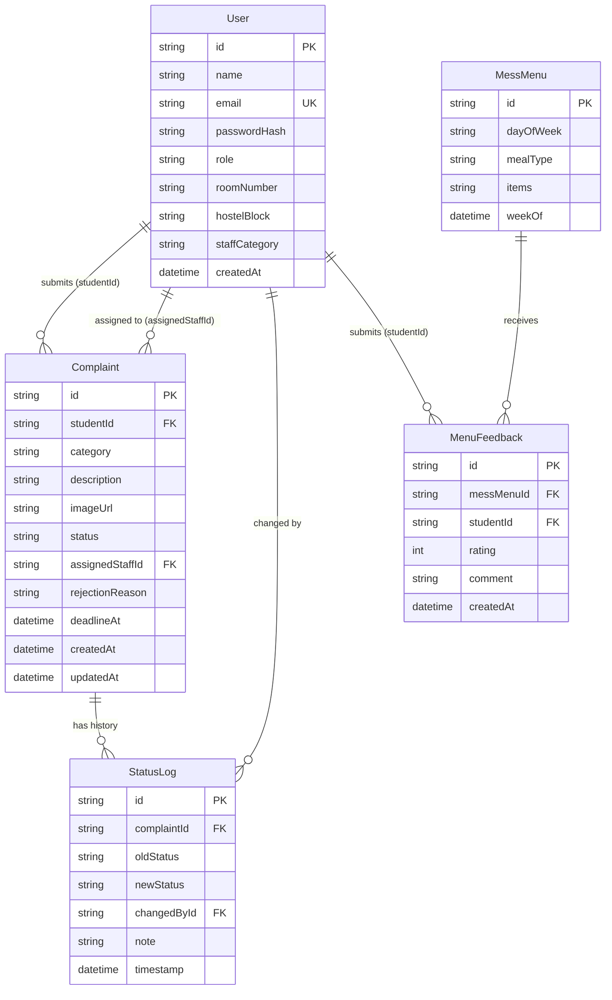

# Entity-Relationship Diagram

## Project Title

**HostelFix — Smart Hostel Complaint & Mess Management System**

---

## Overview

This document defines the entity-relationship (ER) model for the HostelFix database. It describes all entities, their attributes, and the relationships between them.

---

## ER Diagram (Mermaid)



---

## ASCII ER Diagram

```
┌─────────────────────────────────────────────────────────────┐
│                           User                              │
│─────────────────────────────────────────────────────────────│
│ id (PK)          │ name             │ email (UK)            │
│ passwordHash     │ role             │ roomNumber            │
│ hostelBlock      │ staffCategory    │ createdAt             │
└────────────────────────────────────────────────────────────-┘
         │                    │                    │
         │ 1                  │ 1                  │ 1
         │ (studentId)        │ (assignedStaffId)  │ (changedById)
         │                    │                    │
         ▼ many               ▼ many               ▼ many
┌──────────────────────────────────────┐   ┌───────────────────────────┐
│              Complaint               │   │        StatusLog           │
│──────────────────────────────────────│   │───────────────────────────│
│ id (PK)      │ studentId (FK)        │   │ id (PK)                   │
│ category     │ description           │   │ complaintId (FK)          │
│ imageUrl     │ status                │   │ oldStatus                 │
│ assignedStaffId (FK)                 │   │ newStatus                 │
│ rejectionReason │ deadlineAt         │   │ changedById (FK)          │
│ createdAt    │ updatedAt             │   │ note                      │
└──────────────────────────────────────┘   │ timestamp                 │
         │                                 └───────────────────────────┘
         │ 1
         │ (complaintId)
         │
         ▼ many
┌───────────────────────────┐
│        StatusLog          │
│     (same as above)       │
└───────────────────────────┘


┌──────────────────────────────────────┐
│              MessMenu                │
│──────────────────────────────────────│
│ id (PK)      │ dayOfWeek             │
│ mealType     │ items                 │
│ weekOf                               │
└──────────────────────────────────────┘
         │ 1
         │ (messMenuId)
         │
         ▼ many
┌───────────────────────────────────────────────────────────┐
│                     MenuFeedback                          │
│───────────────────────────────────────────────────────────│
│ id (PK)      │ messMenuId (FK)   │ studentId (FK)         │
│ rating (1-5) │ comment           │ createdAt              │
└───────────────────────────────────────────────────────────┘
         ▲
         │ many
         │ (studentId)
         │ 1
┌──────────────────────────────────────┐
│              User                    │
│       (Student submits feedback)     │
└──────────────────────────────────────┘
```

---

## Relationship Definitions

### User → Complaint (studentId)

| Property | Value |
|---|---|
| Type | One-to-Many |
| Description | A User (Student) can submit many Complaints. Each Complaint belongs to exactly one Student. |
| Foreign Key | `Complaint.studentId → User.id` |
| Constraint | `studentId` must reference a User with `role = STUDENT` |

---

### User → Complaint (assignedStaffId)

| Property | Value |
|---|---|
| Type | One-to-Many (nullable) |
| Description | A User (Staff) can be assigned to many Complaints. A Complaint has at most one assigned Staff member. A Complaint may have no assigned staff (nullable). |
| Foreign Key | `Complaint.assignedStaffId → User.id` |
| Constraint | When set, `assignedStaffId` must reference a User with `role = STAFF` |

---

### Complaint → StatusLog

| Property | Value |
|---|---|
| Type | One-to-Many |
| Description | A Complaint has many StatusLog entries — one per status transition. StatusLog records are immutable and form the complaint's audit trail. |
| Foreign Key | `StatusLog.complaintId → Complaint.id` |
| Constraint | Cascade delete: if a Complaint is deleted, all its StatusLog entries are deleted |

---

### User → StatusLog (changedById)

| Property | Value |
|---|---|
| Type | One-to-Many |
| Description | A User (any role) can appear as the actor in many StatusLog entries. Each StatusLog entry references exactly one User. |
| Foreign Key | `StatusLog.changedById → User.id` |

---

### MessMenu → MenuFeedback

| Property | Value |
|---|---|
| Type | One-to-Many |
| Description | A MessMenu entry can receive many feedback submissions. Each MenuFeedback belongs to exactly one MessMenu entry. |
| Foreign Key | `MenuFeedback.messMenuId → MessMenu.id` |

---

### User → MenuFeedback (studentId)

| Property | Value |
|---|---|
| Type | One-to-Many |
| Description | A User (Student) can submit many MenuFeedback entries (across different menu items). Each MenuFeedback belongs to exactly one Student. |
| Foreign Key | `MenuFeedback.studentId → User.id` |
| Constraint | `studentId` must reference a User with `role = STUDENT` |

---

## Role-Differentiated Relationships on User

The `User` table stores all three roles in a single table. The role field differentiates how a User relates to other entities:

| User Role | Relationship |
|---|---|
| STUDENT | Creates Complaints (`studentId`); submits MenuFeedback (`studentId`) |
| STAFF | Is assigned Complaints (`assignedStaffId`); appears as `changedById` in StatusLog for IN_PROGRESS and RESOLVED transitions |
| WARDEN | Appears as `changedById` in StatusLog for APPROVED, REJECTED, ASSIGNED, and CLOSED transitions |

This single-table approach (with role discrimination) is standard for systems where roles share most identity fields (name, email, password) but have a few role-specific optional fields.

---

## Cardinality Summary

| Relationship | Cardinality |
|---|---|
| User → Complaints submitted | 1 : many |
| User → Complaints assigned | 1 : many (nullable) |
| Complaint → StatusLog entries | 1 : many |
| User → StatusLog entries changed | 1 : many |
| MessMenu → MenuFeedback | 1 : many |
| User → MenuFeedback submitted | 1 : many |
